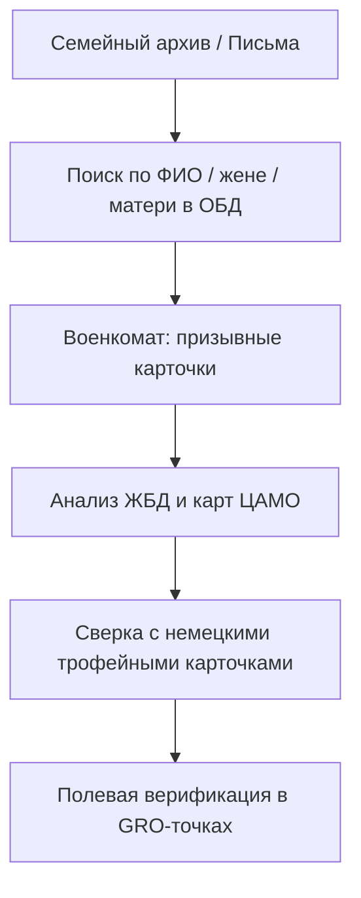

# Научно-практический план комплексного исследования по поиску пропавших без вести советских воинов в Гродненском районе (1941, 1944 гг.)

## 1. Стратегическое введение: Цели и задачи регионального исследования

Гродненский район является уникальным полигоном для военно-мемориальной работы, совмещающим в себе два полярных типа документального наследия. В июне 1941 года здесь разыгралась трагедия «приграничного сражения» в условиях катастрофического окружения (Белостокский «котел»), что привело к фрагментарности советского делопроизводства. Напротив, июль 1944 года — период триумфа операции «Багратион» — характеризуется четкой фиксацией потерь штабами 31-й и 50-й армий. Системный подход требует понимания этой дихотомии: для 1941 года немецкие трофейные источники являются «зеркалом» наших потерь, в то время как для 1944 года первичным вектором выступают советские полевые отчеты. Миссия данного плана — консолидация разрозненных архивных массивов в единый алгоритм установления судеб, где фундаментом поиска служит глубокая историческая реконструкция и точная геопривязка боевых эпизодов.

## 2. Историческая реконструкция и оперативная хронология боев

Для локализации мест захоронений необходимо реконструировать боевые действия на уровне батальонных и ротных участков обороны, систематизируя данные о перемещении подразделений.

### 2.1. Оборона границы и Гродненского УРа (июнь 1941 г.)

* **Узлы сопротивления:** Основной удар VIII армейского корпуса Вермахта (8-я и 28-я пд) приняли заставы 86-го Августовского погранотряда и 68-й укрепленный район. Ключевыми точками героического сопротивления стали д. Новики (застава лейтенанта В. Сивачева, 11 часов боя в окружении) и ДОТ №86 лейтенанта Кобылкина, удерживавший позиции в течение трех суток.
* **Механизированный контрудар:** Реконструирован встречный танковый бой 23 июня в районе Святска и Ратичей. Части 11-го мехкорпуса (29-я и 33-я тд) генерала Д. К. Мостовенко пытались деблокировать 56-ю стрелковую дивизию, что привело к масштабным потерям материальной части (Т-26, БТ-7) и личного состава, захороненного в санитарных ямах вдоль дорог.

### 2.2. Освобождение Гродненского района (июль 1944 г.)

* **Форсирование Немана:** В ходе наступления 31-й и 50-й армий критическое значение приобрели плацдармы в урочищах Пышки и Солы. Особого внимания требует анализ действий 2-го гв. кавалерийского корпуса (3-я и 4-я гв. кд). Переправа велась под огнем танковых дивизий СС «Тотенкопф», что обусловило наличие стихийных захоронений в береговых дюнах.

### Ключевая оперативная хронология:

1. **22 июня 1941:** Оборона 1–4-й застав 86-го ПО и дотов 68-го УР (Сопоцкинский узел).
2. **23 июня 1941:** Бой 29-й тд у Святска и 33-й тд у Ратичей (11-й мк).
3. **24–25 июня 1941:** Оборона Фортов IV, V и VII частями 56-й сд (37-й, 182-й, 213-й сп) и 113-го гаубичного артполка.
4. **17–21 июля 1944:** Бои за плацдарм Пышки — Солы (174-я и 352-я сд, 2-й гв. кк).

Знание боевого пути подразделений позволяет перейти к целенаправленному пофамильному поиску в цифровых и бумажных архивах.

## 3. Методология кросс-платформенного мониторинга и анализа

Переход от стихийного поиска к научному методу базируется на территориально-когортном анализе. Этот метод предполагает формирование полной базы призывников района и их тотальную сверку с реестрами потерь.

### Алгоритм поиска и обхода ошибок:

1. **Первичный мониторинг:** Сплошная выгрузка данных из ОБД «Мемориал», «Память народа» и «Подвиг народа».
2. **Аналитический обход «писарских ошибок»:** При искажении фамилий (неизбежном для многонациональной РККА) критическим фильтром становится поиск по имени матери или жены, а также по точному месту призыва. Опыт показывает, что фамилия может быть неузнаваема, но адрес родственников остается стабильным идентификатором.
3. **Синхронизация с ВИПЦ:** Сверка со «Сводной базой данных ВИПЦ» для выявления именных находок, обнаруженных поисковиками ранее.

### Блок-схема исследовательского цикла:

## 4. Целевой поиск в фондах ЦАМО РФ и зарубежных архивах

Архивная работа в Подольске должна учитывать, что до 80% дел 1941 года могут находиться под грифом «секретно», что требует инициирования процедур рассекречивания согласно приказу №181.

### Реестр ключевых фондов (ЦАМО РФ):

| Фонд | Подразделение | Опись / Дело (Приоритет) | Ожидаемый результат |
|---|---|---|---|
| 210 | 3-я Армия | Оп. 3214, Д. 5, 12 | ЖБД, карты дислокации 56-й и 85-й сд. |
| 336 | 11-й мехкорпус | Оп. 1, Д. 4, 7 | Доклады Мостовенко о контрударе. |
| 1172 | 56-я сд | Оп. 1, Д. 2, 3, 8 | Документы 37, 182, 213 сп; 113-го ГАП. |
| 386 | 36-й СК (31-я А) | Оп. 8583, Д. 124–135 | ЖБД 174-й и 352-й сд (июль 1944). |
| 3470 | 2-й гв. кавкорпус | Оп. 1, Д. 45–52 | Бои 3-й и 4-й гв. кд у переправы Пышки. |
| 68 УР | Гродненский УР | Оп. 2, Д. 1–14 | Схемы узлов обороны Сопоцкин, Новики. |

### Немецкие источники как инструмент верификации:

При отсутствии советских данных по 1941 году необходимо обращаться к массивам NARA и Bundesarchiv:

* **NARA T-314 (Rolls 980–983):** ЖБД VIII армейского корпуса — содержат описания штурма конкретных ДОТов и застав.
* **NARA RG-373 (Luftwaffe Photos):** Аэрофотосъемка (Sorties GX 12450/51-SD) позволяет локализовать воронки и траншеи 1941 г., ныне скрытые рельефом.

## 5. Дешифровка судеб: Документация военнопленных и ПФД

Специализация по немецкому делопроизводству позволяет восстановить судьбу воина по карточкам регистрации (около 3.2 млн в ЦАМО).

### Анализ персональных карточек (PK I и PK III):

* **Personalkarte I:** Основной регистрационный бланк. Важны «цветные штампы»: красный штамп «Asiat» (азиат) или отметки о запрете связей с немецкими женщинами («Belehrt über das Verbot betr. Verkehr mit deutschen Frauen»).
* **Personalkarte III:** Содержит сведения о перемещениях и смерти. Штамп «Gem. m. Abg. Liste» подтверждает, что данные о смерти переданы в справочную службу Вермахта (WASt).
* **Каналы поиска:** Прямые запросы в ITS Arolsen и Центр документации в Дрездене (Dokumentationsstelle Dresden).

### Проверочно-фильтрационные дела (ПФД):

В случае отрицательного ответа из ЦА ФСБ, необходимо обращаться в Информационные центры (ИЦ) УВД по месту рождения или призыва. ПФД содержат протоколы допросов, позволяющие восстановить обстоятельства пленения в Гродненском районе.

## 6. Реестр геопривязанных поисковых точек (GRO-Registry)

На основе анализа карт и донесений сформирован реестр объектов для полевой разведки.

| Код | Локация | Координаты | Тип | Глубина залегания | Рекомендации |
|---|---|---|---|---|---|
| GRO-41-002 | д. Новики | 53.8155, 23.6102 | Застава | 0.8–1.6 м | Шурфование восточного бруствера капонира Сивачева. |
| GRO-41-003 | ДОТ №86 | 53.8189, 23.6145 | ДОТ | 1.5–2.5 м | Расчистка сквозника, проверка воронки взрыва. |
| GRO-41-004 | Святск | 53.7975, 23.6642 | Санзахор. | 0.6–1.2 м | Поиск танкистов в ПТ-рву к северу от парка. |
| GRO-44-001 | ур. Пышки | 53.7251, 23.8154 | Переправа | 0.5–1.2 м | Георадарное профилирование песчаных дюн. |
| GRO-41-011 | д. Доргунь | 53.8510, 23.5820 | Заставы | 0.7–1.4 м | Шурфование опушки леса к западу от деревни. |

## 7. Заключение: Стратегия реализации плана

Успех комплексного исследования Гродненского района заключается в бесшовной интеграции архивных находок ЦАМО РФ, немецких оперативных документов NARA и полевой разведки. Итогом реализации плана должно стать создание Единого цифрового реестра воинов Гродненщины, объединяющего биографические данные с точными координатами мест их последнего боя. Это высшая форма увековечения памяти, превращающая «пропавшего без вести» в Героя с установленной судьбой.

### Список основных ресурсов:

1. **ОБД «Мемориал» / «Память народа»** ([pamyat-naroda.ru](https://pamyat-naroda.ru)) — базовые реестры МО РФ.
2. **ВИПЦ** ([v-ipc.ru](https://v-ipc.ru)) — результаты полевых поисковых работ.
3. **Dokumentationsstelle Dresden** ([stsg.de](https://www.stsg.de)) — база данных военнопленных.
4. **NARA (National Archives and Records Administration)** — фонды T-314, T-315.
5. **ЦАМО РФ** ([archive.mil.ru](https://archive.mil.ru)) — фонды 210, 336, 1172, 386, 3470.
