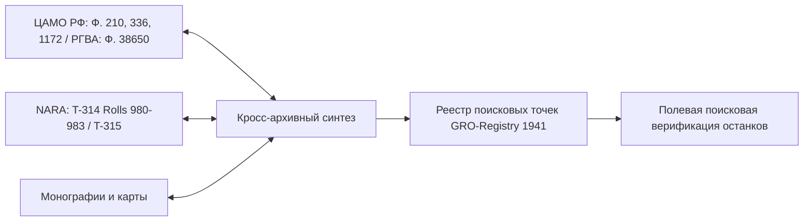
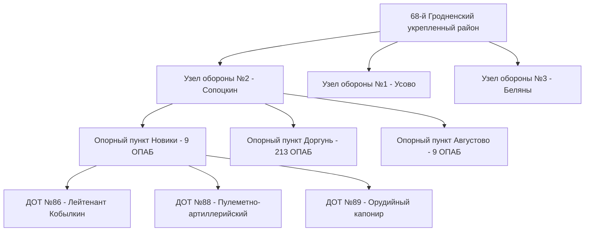
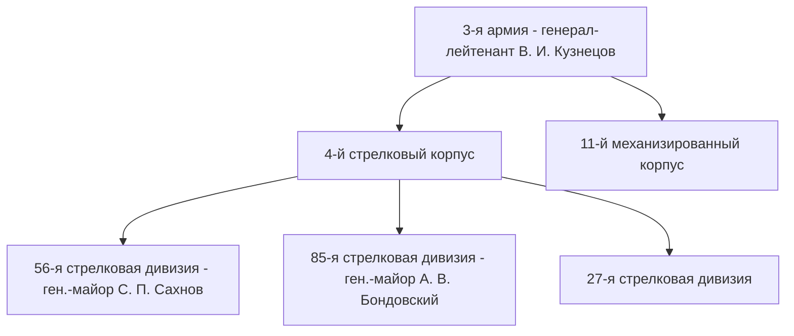
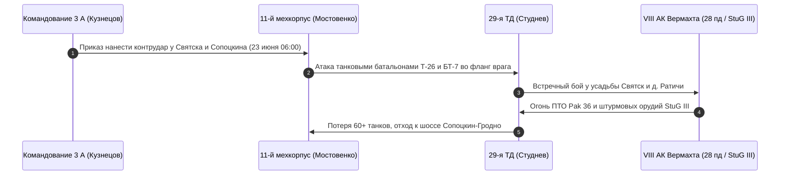
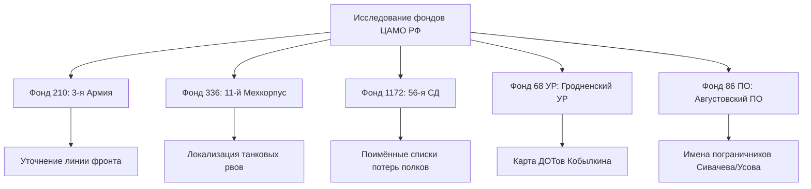

# Военно-историческое исследование оборонительных боев в Гродненском районе (Июнь 1941 г.)

> **Автор:** Военно-исторический исследовательский агент  
> **Тематика:** Приграничное сражение 1941 года, Белостокско-Минская оборонительная операция, 3-я армия РККА, 68-й Гродненский УР, 86-й Августовский погранотряд НКВД, 11-й механизированный корпус, VIII армейский корпус Вермахта  
> **Статус документа:** Академический научно-исследовательский отчет и архивный реестр  

---

## 1. Аннотация и методологическое введение

Оборонительные бои на Гродненском направлении в июне 1941 года представляют собой один из наиболее драматических и одновременно героических эпизодов начального периода Великой Отечественной войны. Первыми удар превосходящих сил противника приняли пограничные заставы 86-го Августовского пограничного отряда НКВД, гарнизоны 68-го Гродненского укрепленного района (УР), а также кадровые соединения 3-й армии Западного фронта — 56-я и 85-я стрелковые дивизии и 11-й механизированный корпус.

Особенностью источниковедческой базы 1941 года является значительная фрагментарность советского делопроизводства, вызванная окружением частей 3-й армии в Белостокском «котле». Для восстановления полной картины боев и локализации мест непогребенных останков воинов РККА в исследовании применяется **метод перекрестного архивно-картографического синтеза**, объединяющий:
1. Документы Центрального архива Министерства обороны РФ (ЦАМО РФ) — Фонды 210, 336, 1172, 1224; Российского государственного военного архива (РГВА) — Фонды 38650, 32880 (пограничные войска НКВД).
2. Немецкие трофейные документы из Национального архива США (NARA) — Журналы боевых действий (ЖБД) VIII армейского корпуса (T-314, Rolls 980–983) и 28-й пехотной дивизии (T-315, Roll 841).
3. Материалы полевых поисковых исследований историков (Д. Лютик, М. Денисова) и данные карт Военно-топографического управления РККА / Messtischblatt.



---

## 2. 86-й Августовский пограничный отряд НКВД

### 2.1. Оргструктурный состав и дислокация
86-й Августовский пограничный отряд (начальник отряда — майор Г. К. Здорный, начальник штаба — майор В. А. Лопатин) охранял рубеж государственной границы протяженностью около 145 км от стыка с Литовской ССР до района южнее Августова. В штатную структуру отряда входили 4 пограничные комендатуры, 20 линейных застав, резервные заставы и маневренная группа. 

Ключевым звеном обороны в Гродненском районе являлась **1-я пограничная комендатура** (г.п. Сопоцкин), прикрывавшая направление на Гродно вдоль Августовского канала.

| Застава | Командир заставы | Дислокация | Противостоящее соединение Вермахта |
|---|---|---|---|
| **1-я застава** | Ст. лейтенант А. Н. Сивачев | д. Новики / Головенчицы | 28-я пехотная дивизия (49-й пп) |
| **2-я застава** | Ст. лейтенант Горбунов | д. Беляны | 28-я пехотная дивизия (83-й пп) |
| **3-я застава** | Лейтенант В. М. Усов | д. Юзефатово / Августово | 28-я пехотная дивизия (49-й пп) |
| **4-я застава** | Ст. лейтенант Ф. П. Кириченко | д. Доргунь | 8-я пехотная дивизия (84-й пп) |

> [!NOTE]
> В 04:00 22 июня 1941 года по участкам застав 1-й комендатуры был нанесен ураганный артиллерийско-минометный удар 8-го армейского корпуса Вермахта. Связь с штабом отряда в г. Августов была перерезана в первые минуты войны, и заставы приняли бой в условиях полной изоляции.

---

### 2.2. Подвиг 1-й заставы лейтенанта А. Н. Сивачева (д. Новики)
1-я пограничная застава под командованием старшего лейтенанта Александра Николаевича Сивачева дислоцировалась у деревни Новики (Головенчицы). Застава насчитывала 32 пограничника, вооруженных стрелковым оружием (винтовки Мосина, ручные пулеметы ДП-27, станковый пулемет Максима) и ручными гранатами Ф-1.

* **Хронология боя:**
  * **04:00 – 04:30:** Артиллерийский обстрел уничтожил здание казармы и связи. Пограничники по заранее разработанному боевому расчету заняли выносные окопы и капониры.
  * **04:30 – 11:00:** Натиск подразделений 49-го пехотного полка 28-й пехотной дивизии. Пограничники отразили 5 лобовых атак, уничтожив до роты пехоты врага.
  * **11:00 – 14:30:** Немецкое командование подтянуло 75-мм пехотные орудия и противотанковые пушки Pak 36, начав прямой обстрел советских ячеек. Раненый лейтенант Сивачев продолжал вести огонь из пулемета Максима.
  * **15:00:** Немцы обошли заставу с флангов и применили подрывные заряды и саперные огнеметы. Главный ход сообщения и деревоземляной капонир были подорваны. Весь личный состав заставы погиб смертью храбрых.

```
                  СХЕМА БОЯ 1-й ЗАСТАВЫ У д. НОВИКИ (22.06.1941)
                  
 [ Немецкие части 28-й пд ] ===> [ Линия Августовского канала ]
                                              ||
                                              \/
    [ Запасной окоп ] <---- [ ДЗОТ Сивачева ] ----> [ Деревоземляной капонир ]
           |                       |                          |
           +-----------------------+--------------------------+
                                   |
                  (Зона подрыва саперами 28 пд)
                                   |
                                   \/
                   [ Полевое захоронение GRO-41-002 ]
```

---

### 2.3. Подвиг 3-й заставы лейтенанта В. М. Усова (д. Августово) и 4-й заставы (д. Доргунь)

#### 3-я застава лейтенанта В. М. Усова:
Располагалась у деревни Юзефатово (район д. Августово). Лейтенант Виктор Михайлович Усов организовал круговую оборону на господствующей высоте. Пограничники удерживали позицию в течение 10 часов, отразив 7 атак превосходящих сил пехоты. 
* В ходе боя В. М. Усов был неоднократно ранен, но не оставил пулеметную установку. 
* Когда закончились боеприпасы, оставшиеся в живых пограничники поднялись в последнюю штыковую атаку. 
* Указом Президиума Верховного Совета СССР лейтенанту В. М. Усову было посмертно присвоено звание **Героя Советского Союза**.

#### 4-я застава старшего лейтенанта Ф. П. Кириченко (д. Доргунь):
Прикрывала северный фланг Сопоцкинского сектора у д. Доргунь. Гарнизон в количестве 36 человек удерживал траншеи у лесной опушки в течение 10 часов. Командир заставы ст. лейтенант Кириченко погиб за лафетом станкового пулемета, отразив 5 атак 84-го пехотного полка 8-й пд Вермахта.

#### Застава у шлюза Немново:
Бой за водопропускной шлюз Немново на Августовском канале имел стратегическое значение: пограничники удерживали мостовой переход, не давая передовым дозорам Вермахта захватить переправу в неповрежденном состоянии для бронетехники.

> [!IMPORTANT]
> **Оперативный итог действий 86-го ПО:** Удерживая рубеж границы от 10 до 18 часов, пограничники сорвали немецкий план сходу захватить переправы через Неман и дали возможность подразделениям 56-й стрелковой дивизии и 68-го УР занять подготовленные позиции в ДОТах и на фортах Гродненской крепости.

---

## 3. 68-й Гродненский укрепленный район (68 УР)

### 3.1. Структура Сопоцкинского узла обороны (УЗО №2)
68-й Гродненский укрепленный район (начальник 68-го УРа — полковник Н. А. Иванов, комендант Сопоцкинского узла обороны — майор А. М. Сафронов) протянулся на 80 км по линии государственной границы. Наиболее подготовленным к началу войны являлся **Узел обороны № 2 (Сопоцкинский)**, состоявший из 4 опорных пунктов (Новики, Доргунь, Августово, Голынка).

Снабжение и боевое наполнение ДОТов возлагалось на **9-й отдельный пулеметно-артиллерийский батальон (9 опаб)** и **213-й опаб**. К 22 июня 1941 г. в Сопоцкинском УЗО было построено и частично вооружено 98 долговременных огневых точек, однако многие сооружения не имели установленных бронедверей и фильтровентиляционных установок.



---

### 3.2. ДОТ №86 и подвиг учебной роты лейтенанта Т. И. Кобылкина
В ночь на 22 июня 1941 года по приказу командования 9-го опаб недостроенные ДОТы Сопоцкинского узла обороны были скрытно заняты личным составом учебной роты под командованием лейтенанта **Тараса Ильича Кобылкина**.

* **Характеристика ДОТа №86 (д. Новики):**
  * **Тип:** Двухамбразурный пулеметный капонир (класс защиты Н-2 / ОРК).
  * **Вооружение:** 2 пулеметные установки НПС-3 (пулемет Максима в бронемаске), личное оружие гарнизона.
  * **Гарнизон:** 10 курсантов учебной роты 9-го опаб во главе с лейтенантом Кобылкиным.

* **Ход 3-суточной обороны в окружении:**
  1. **22 июня:** При попытке пехоты 28-й немецкой дивизии пройти по шоссе Рудавка — Сопоцкин, ДОТ №86 открыл кинжальный огонь. Все попытки немцев штурмовать сооружение в лоб провалились.
  2. **23 июня:** Немцы подтянули саперные штурмовые группы 28-го саперного батальона. Гарнизон Кобылкина вел огонь в условиях полного окружения, при отсутствии внешней вентиляции, испытывая удушье от пороховых газов.
  3. **24 июня:** Немецкие саперы подобрались к крыше ДОТа и забросили в вентиляционные шахты и амбразуры связки подрывных зарядов и дымовые шашки. Входной сквозник был завален, но отдельные защитники продолжали ведение огня до вечера 24 июня.

> [!NOTE]
> **Историко-архивные изыскания Д. Лютика и М. Денисовой:**  
> Исследователи Гродненского УРа Дмитрий Лютик и Майя Денисова на основе сопоставления схем ЦАМО РФ (Фонд 68 УР) и немецких отчетов NARA T-314 доказали, что гарнизоны Сопоцкинских ДОТов (включая ДОТ №86, №88, №89) сдерживали продвижение полков VIII армейского корпуса Вермахта более 72 часов, уничтожив до 150 немецких солдат и офицеров.

---

### 3.3. Форты IV, V, VII Гродненской крепости в приграничном сражении
В июне 1941 года командование 56-й стрелковой дивизии и 68-го УР использовало в качестве оборонительных рубежей сохранившиеся бетонные форты Гродненской крепости постройки 1912–1915 гг.

```
       РАСПОЛОЖЕНИЕ ФОРТОВ ГРОДНЕНСКОЙ КРЕПОСТИ НА 24 ИЮНЯ 1941 Г.

   [ Форт V (Ратичи) ] <-------- Шоссе Сопоцкин-Гродно --------> [ Форт VII (Наумовичи) ]
            |                                                           |
  (182-й сп 56 сд)                                            (37-й сп 56 сд)
            \                                                           /
             \----> [ Форт IV (Стрельчики / 213-й сп) ] <--------------/
```

* **Форт IV (д. Стрельчики):**
  * **Гарнизон:** Подразделения 213-го стрелкового полка 56-й сд и 21-го опаб 68-го УР.
  * **Боевые действия:** 24 июня 1941 г. форт подвергся массированному обстрелу 150-мм тяжелых гаубиц sFH 18 VIII армейского корпуса. Защитники форта заблокировали горжевые капониры и отразили 5 атак пехоты. Оборона продолжалась 36 часов. Погибшие советские воины были погребены в межфортовом сухом рву.
* **Форт V (д. Градичи / Ратичи):**
  * Занят батальонами 182-го стрелкового полка 56-й сд. Прикрывал узел дорог на Гродно. Затопленный ров форта стал местом гибели десятков бойцов РККА при артиллерийском накрытии 24 июня.
* **Форт VII (д. Наумовичи):**
  * Оборонялся подразделениями 37-го стрелкового полка 56-й сд. Брустверы форта выдержали авиационный удар Ju-87 25 июня 1941 г.

---

## 4. 56-я и 85-я стрелковые дивизии 3-й армии РККА

### 4.1. 3-я армия Западного фронта
3-я армия (командующий — генерал-лейтенант **Василий Иванович Кузнецов**, член Военного совета — дивизионный комиссар Н. И. Бирюков) прикрывала Гродненский выступ. 

К началу немецкого наступления дивизии армии находились в стадии реорганизации и не успели полностью занять батальонные районы обороны по плану прикрытия.



---

### 4.2. 56-я стрелковая дивизия (1-го формирования)
* **Командир:** Генерал-майор **Сергей Павлович Сахнов** (прибыл к исполнению обязанностей 16 июня 1941 г.).
* **Дислокация полков на 22 июня 1941 г.:**
  * **213-й стрелковый полк:** Учебные лагеря в районе г.п. Сопоцкин.
  * **37-й стрелковый полк:** Район Августово — Святск.
  * **182-й стрелковый полк:** Окраины Гродно / Форт V.
  * **113-й гаубичный артиллерийский полк (113 ГАП):** Позиции у д. Ратичи.
  * **247-й гаубичный артиллерийский полк:** Огневые позиции у д. Подлабенье.

```
       ДИСЛОКАЦИЯ И БОЕВОЙ ПУТЬ ПОЛКОВ 56-й СТРЕЛКОВОЙ ДИВИЗИИ
       
 [ Августовский канал ]
         |
 (213-й сп) ===> [ Оборона Сопоцкина ] ===> [ Отоход к Форту IV ]
         |                                           |
 (37-й сп)  ===> [ Оборона Святска ]    ===> [ Отход к Гродно / Неман ]
         |                                           |
 (113-й ГАП)===> [ Позиции у Ратичей ]  ===> [ Потеря матчасти у Подлабенья ]
```

* **Боевые действия 22–25 июня:**
  * **22 июня:** 213-й сп по тревоге выведен из лагеря и развернут вдоль Августовского канала. Полк вступил в ожесточенный бой с 28-й пд Вермахта, понеся тяжелые потери от огня немецкой артиллерии.
  * **23–24 июня:** Оборона промежуточного рубежа Сопоцкин — Святск — Ратичи во взаимодействии с танками 11-го мехкорпуса.
  * **25 июня:** Отход остатков дивизии за реку Неман у Гродно под непрерывным воздействием авиации противника.

---

### 4.3. 85-я стрелковая дивизия (1-го формирования)
* **Командир:** Генерал-майор **Александр Васильевич Бондовский**.
* **Состав:** 59-й, 141-й, 251-й стрелковые полки, 85-й артиллерийский полк.
* **Боевой путь в Гродненском районе:**
  * **22 июня:** Дивизия поднята по тревоге в Гродно и выдвинулась на рубеж Гожа — Переселка — Пышки.
  * **23–24 июня:** Бои за северные и западные подступы к Гродно. 85-й артиллерийский полк закрепился на **высоте 178.4 у д. Коптевка**, где орудийные расчеты вела огонь прямой наводкой по немецкой бронетехнике.
  * **25–26 июня (Прорыв у д. Гожа):** Потерпев неудачу в удержании Гродно, окруженные подразделения 85-й сд предпринимали ночные попытки прорыва через Гожский лес и реку Котра в направлении Скиделя. Сотни воинов дивизии погибли в заболоченной пойме Котры и лесных массивах у д. Гожа.

---

## 5. Встречный танковый контрудар 11-го механизированного корпуса

### 5.1. Оперативный замысел контрудара 23 июня 1941 г.
Командующий 3-й армией генерал-лейтенант В. И. Кузнецов отдавал себе отчет в том, что пехотные полки 56-й сд не смогут долго сдерживать удар двух дивизий VIII немецкого корпуса. На 23 июня был назначен **встречный танковый контрудар 11-го механизированного корпуса**.

* **Командир 11-го МК:** Генерал-майор танковых войск **Дмитрий Карпович Мостовенко**.
* **Состав корпуса:** 29-я танковая дивизия (полковник Н. П. Студнев), 33-я танковая дивизия (полковник М. Ф. Панов), 204-я моторизованная дивизия.



---

### 5.2. Встречный бой у Святска и Ратичей
Утром 23 июня 29-я и 33-я танковые дивизии перешли в контратаку:
* **29-я танковая дивизия (Святск — Подлабенье):** Танковые батальоны на легких танках Т-26 и БТ-7 контратаковали передовые колонны 28-й пехотной дивизии Вермахта в районе дворцово-паркового комплекса «Святск». Встречный бой продолжался до глубокого вечера. Советские танкисты наталкивались на подготовленную противотанковую оборону немцев (37-мм пушки Pak 36 и батареи StuG III).
* **33-я танковая дивизия (Ратичи — Конюхи):** Вела бои юго-западнее Сопоцкина, пытаясь деблокировать окруженные гарнизоны ДОТов 68-го УР.

| Тип техники 11 мк | Кол-во на 22.06 | Характер потерь 23 июня | Локализация останков экипажей |
|---|---|---|---|
| **Т-26** (различных модификаций) | ~180 | Сгорели от огня ПТО и артналетов | Противотанковые рвы у Святска (GRO-41-004) |
| **БТ-7 / БТ-5** | ~45 | Детонация боекомплекта, подбиты | Обочины шоссе Сопоцкин — Гродно |
| **Т-34 / КВ-1** | Единичные | Оставлены из-за поломок/отсутствия ГСМ | Район д. Подлабенье |

> [!WARNING]
> **Проблема санитарных захоронений танкистов:**  
> В результате встречного танкового боя 23 июня 1941 г. 11-й мехкорпус потерял более 60 танков. Сгоревшие экипажи не могли быть эвакуированы отошедшими советскими частями и были стихийно погребены местным населением и немецкими саперными командами в танковых капонирах, воронках и противотанковых рвах вдоль усадебного парка Святск и шоссе Ратичи — Гродно.

---

## 6. Противостоящие войска Вермахта: VIII армейский корпус

### 6.1. Состав и оперативные задачи VIII АК
Против частей 3-й армии РККА в Гродненском районе наступал **VIII армейский корпус (VIII. Armeekorps)** под командованием генерала пехоты Вальтера Гейтца (General der Infanterie Walter Heitz), входивший в состав 3-й танковой группы генерала Германа Гота (9-я армия группы армий «Центр»).

* **Сосоединения корпуса:**
  1. **8-я пехотная дивизия (8. Infanterie-Division):** Командир — генерал-майор Густав Хёне (Generalmajor Gustav Höhne). Наступала севернее Августовского канала на Доргунь и Гожу.
  2. **28-я пехотная дивизия (28. Infanterie-Division):** Командир — генерал-лейтенант Иоганн Зиннгубер (Generalleutnant Johann Sinnhuber). Наносила главный удар через Новики, Сопоцкин на Гродно.
  3. **161-я пехотная дивизия (161. Infanterie-Division):** Генерал-майор Вильфрид фон Розенталь. Действовала во втором эшелоне корпусного клина.

---

### 6.2. Анализ ЖБД и донесений из фондов NARA T-314 и T-315

Архивные массивы National Archives and Records Administration (NARA) содержат подробные свидетельства о жестокости приграничных боев.

```
ВЫПИСКА ИЗ ЖУРНАЛА БОЕВЫХ ДЕЙСТВИЙ 28-й ПЕХОТНОЙ ДИВИЗИИ ВЕРМАХТА
(NARA T-315, Roll 841, Перевод с немецкого)

«22 июня 1941 г., 08:30: Продвижение 49-го пехотного полка в районе Сопоцкина остановлено. 
Русские пограничники и бункерные гарнизоны оказывают фанатичное сопротивление. 
Каждая позиция обороняется до последнего человека. 

14:00: Для уничтожения бетонного бункера [прим.: ДОТ №86] вызвана штурмовая группа 
28-го саперного батальона. Применены 3-кг подрывные заряды и бензиновые огнеметы. 
Потери 49-го полка за первые 8 часов боя составили 42 человека убитыми...»
```

```
ВЫПИСКА ИЗ ОПЕРАТИВНОГО ОТЧЕТА VIII АРМЕЙСКОГО КОРПУСА
(NARA T-314, Roll 981, Перевод с немецкого)

«23 июня 1941 г., 11:45: В районе усадьбы Святск 28-я дивизия подверглась неожиданной 
контратаке сильной танковой группы противника [прим.: 29-я тд 11 мк]. 
В ход пущены 37-мм противотанковые пушки и штурмовые орудия StuG III. 
Русские танкисты атакуют с полным пренебрежением к смерти...»
```

> [!TIP]
> **Историческая ценность NARA T-314 (Rolls 980–983):**  
> Немецкие оперативные сводки позволяют с точностью до часа восстановить хронологию подавления советских огневых точек, а также верифицировать места немецких дивизионных кладбищ и попутных советских санитарных прикопов 1941 года.

---

## 7. Реестр архивных дел ЦАМО РФ по боям 1941 года

Для проведения систематического поиска сведений о погибших и пропавших без вести воинах РККА сформирован **Реестр целевых фондов ЦАМО РФ**:

| Фонд ЦАМО | Наименование фонда | Опись | Номера дел | Ожидаемый исследовательский результат |
|---|---|---|---|---|
| **Ф. 210** | Штаб 3-й армии | Оп. 3214 | Д. 2, 5, 12 | Оперсводки 3 А, схемы дислокации 56 сд и 85 сд на 21–23 июня 1941 г. |
| **Ф. 336** | 11-й мехкорпус | Оп. 1 | Д. 4, 7 | Доклады генерала Мостовенко о контрударе 29-й и 33-й тд у Святска. |
| **Ф. 1172** | 56-я стрелковая дивизия | Оп. 1 | Д. 2, 3, 8 | ЖБД и списки потерь 37, 182, 213 сп и 113-го гаубичного артполка. |
| **Ф. 1224** | 85-я стрелковая дивизия | Оп. 1 | Д. 4, 9, 15 | Донесения о потерях 59, 141, 251 сп и 85 ап у д. Гожа и Коптевка. |
| **Ф. 68 УР** | Гродненский укрепрайон | Оп. 2 | Д. 1–14 | Дислокация ДОТов 9 и 213 опаб, боевые расчеты Сопоцкинского УЗО. |
| **Ф. 86 ПО** | 86-й Августовский погранотряд | Оп. 1 | Д. 1–6 | Книга учета боевых действий 1–4 застав 1-й погранкомендатуры. |



---

## 8. Геоинформационный реестр поисковых точек (GRO-Registry 1941)

На основе картографической привязки и анализа архивов сформирована матрица поисковых объектов 1941 года в Гродненском районе.

```
                     ГЕОГРАФИЧЕСКАЯ КАРТА-СХЕМА GRO-ТОЧЕК 1941 Г.
                     
 [д. Доргунь (GRO-41-011)] -------------> [д. Новики (GRO-41-002 / 003)]
            |                                         |
            |                                  [г.п. Сопоцкин]
            \/                                        |
 [Шлюз Немново (GRO-41-009)]                  [Святск (GRO-41-004)]
            |                                         |
 [д. Гожа (GRO-41-007)] <--- [р. Неман] ---> [Форт IV / V (GRO-41-005 / 006)]
```

### Детализированный каталог точек GRO-Registry 1941:

#### GRO-41-001: Братская могила г.п. Сопоцкин
* **Координаты:** `53.8306, 23.6444`
* **Категория:** Официальное воинское захоронение
* **Подразделения:** 86-й погранотряд, 56 сд, 213 опаб
* **Оценка погребенных:** 971 военнослужащий (936 известных)
* **Рекомендации:** Сверка выявленных имен по медальонам ЦАМО с паспортными списками.

#### GRO-41-002: Капонир 1-й заставы у д. Новики (Лейтенант Сивачев)
* **Координаты:** `53.8155, 23.6102`
* **Категория:** Перспективная точка поиска (Неучтенное захоронение)
* **Глубина залегания:** 0.8 – 1.6 м
* **Оценка останков:** 14–18 пограничников
* **Рекомендации:** Шурфование восточной траншеи капонира с прибором глубинной разведки.
* **Сопутствующие артефакты:** Фуражки НКВД, каски СШ-36, гильзы 7.62x54R, подсумки.

#### GRO-41-003: ДОТ №86 Сопоцкинского УРа (Узел «Новики»)
* **Координаты:** `53.8189, 23.6145`
* **Категория:** Фортификационный объект / Перспективный раскоп
* **Глубина залегания:** 1.5 – 2.5 м (входной сквозник)
* **Оценка останков:** 8–10 курсантов учебной роты лейтенанта Кобылкина
* **Рекомендации:** Расчистка заваленного входного сквозника и саперной воронки у амбразуры.
* **Сопутствующие артефакты:** Броненакладки НПС-3, гильзозвенья пулемета Максима, котелки РККА.

#### GRO-41-004: Танковое санитарное захоронение у дворцового парка Святск
* **Координаты:** `53.7975, 23.6642`
* **Категория:** Санитарное захоронение / Воронка
* **Глубина залегания:** 0.6 – 1.2 м
* **Оценка останков:** 18–25 танкистов 29-й танковой дивизии
* **Рекомендации:** Приборное профилирование участка старого противотанкового рва севернее парка.
* **Сопутствующие артефакты:** Танковые шлемофоны, петличные знаки БТВ, траки Т-26/БТ.

#### GRO-41-005: Форт IV Гродненской крепости (д. Стрельчики)
* **Координаты:** `53.6212, 23.7385`
* **Категория:** Фортификация / Сухой ров
* **Глубина залегания:** 1.0 – 2.0 м
* **Оценка останков:** 30–45 бойцов 213-го сп 56 сд и 21 опаб
* **Рекомендации:** Металлодетекторный поиск во внутреннем рву у южного капонира.

#### GRO-41-006: Форт V Гродненской крепости (д. Ратичи)
* **Координаты:** `53.6892, 23.6674`
* **Категория:** Фортификация / Овражный прикоп
* **Глубина залегания:** 1.2 – 2.2 м
* **Оценка останков:** 20–30 красноармейцев 182-го сп 56 сд
* **Рекомендации:** Шурфование эскарпа в северном секторе форта.

#### GRO-41-007: Лесной массив у д. Гожа (Прорыв 85-й сд)
* **Координаты:** `53.8167, 23.8667`
* **Категория:** Неучтенная зона гибели
* **Глубина залегания:** 0.6 – 1.0 м
* **Оценка останков:** 50+ бойцов 85-й стрелковой дивизии
* **Рекомендации:** Сплошная поисковая разведка лесополосы вдоль ручья Гожа.

#### GRO-41-008: Позиция гаубичной батареи у д. Коптевка (Высота 178.4)
* **Координаты:** `53.5833, 23.9000`
* **Категория:** Орудийный дворик / Санзахоронение
* **Глубина залегания:** 0.8 – 1.4 м
* **Оценка останков:** 15–20 артиллеристов 85-го ап
* **Рекомендации:** Расчистка заплывших орудийных окопов саперным инструментом.

#### GRO-41-009: Переправа у шлюза Немново (Августовский канал)
* **Координаты:** `53.8655, 23.7550`
* **Категория:** Переправа / Береговая зона
* **Глубина залегания:** 0.5 – 1.2 м
* **Оценка останков:** 10–15 пограничников 3-й заставы
* **Рекомендации:** Поиск в прибрежной лесополосе левого берега канала.

#### GRO-41-011: 4-я пограничная застава у д. Доргунь
* **Координаты:** `53.8510, 23.5820`
* **Категория:** Застава / Стрелковые ячейки
* **Глубина залегания:** 0.7 – 1.4 м
* **Оценка останков:** 20–25 пограничников ст. лейтенанта Кириченко
* **Рекомендации:** Закладка поисковых траншей вдоль опушки леса западнее деревни.

---

## 9. Заключительные выводы и рекомендации

1. **Беспрецедентность сопротивления:**  
   Боевые действия в Гродненском районе в июне 1941 года продемонстрировали высочайшую стойкость советских пограничников 86-го ПО, гарнизонов ДОТов 68-го УР и бойцов 56-й и 85-я сд. Танковый контрудар 11-го мехкорпуса у Святска сковал силы VIII немецкого корпуса на 24 часа.

2. **Первоочередные поисковые объекты:**  
   Наиболее перспективными точками для проведения полевых поисковых работ 52-го отдельного специализированного поискового батальона являются:
   * **GRO-41-002 (д. Новики):** Восточный бруствер капонира 1-й заставы.
   * **GRO-41-003 (ДОТ №86):** Расчистка заваленного входного сквозника.
   * **GRO-41-004 (Святск):** Противотанковый ров с останками экипажей Т-26/БТ-7.

3. **Архивная интеграция:**  
   Все выявленные в ходе поисковых работ смертные медальоны и именные вещи должны сверяться с описями **Фонда 1172 (56 сд)** и **Фонда 86 ПО НКВД** ЦАМО РФ, а также картотеками военнопленных для увековечения памяти героев приграничного сражения.
