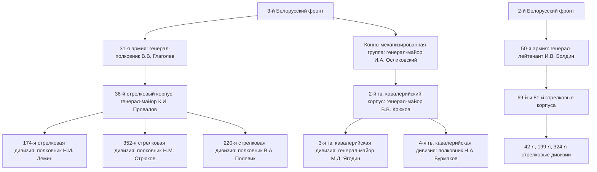
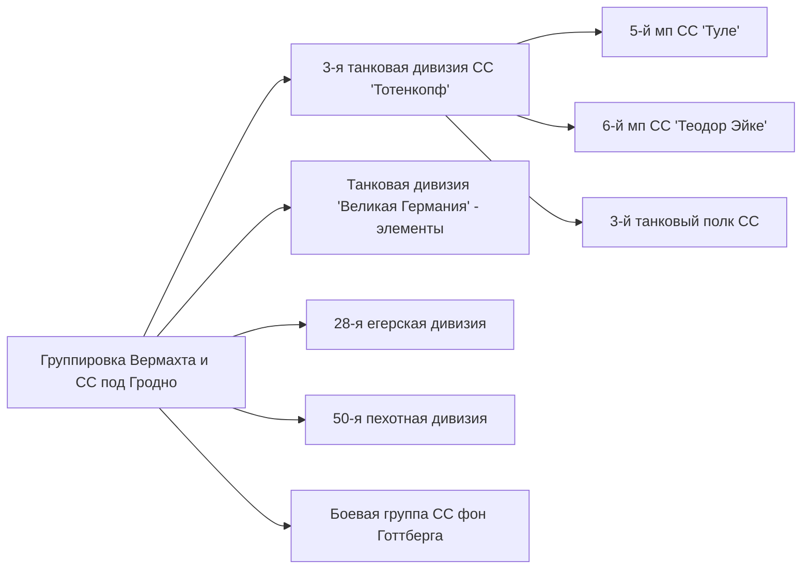
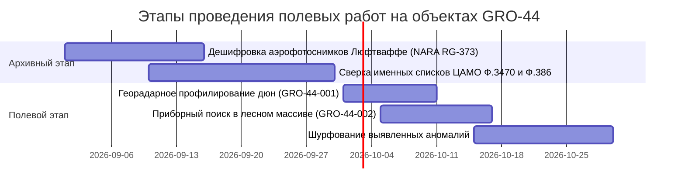

# Военно-историческое исследование: Освобождение Гродненского района и форсирование реки Неман в июле 1944 года (Операция «Багратион»)

## Аннотация
Настоящий научно-исследовательский отчет посвящен глубокой военно-исторической реконструкции боевых действий соединений Красной Армии по освобождению Гродненского района и форсированию реки Неман в июле 1944 года в ходе Белостокской наступательной операции (составная часть Белорусской стратегической операции «Багратион»). Документ консолидирует данные Центрального архива Министерства обороны Российской Федерации (ЦАМО РФ), Национального архива США (NARA), Федерального архива Германии (Bundesarchiv), картографические материалы и результаты полевых разведок. Отчет разработан в качестве методологической базы для проведения военно-мемориального и поискового мониторинга по локализации неучтенных санитарных и стихийных захоронений советских воинов.

---

## 1. Наступление войск 31-й и 50-й армий в июле 1944 г.

### 1.1. Стратегический контекст и оперативный замысел
К середине июля 1944 года в результате разгрома главных сил немецкой группы армий «Центр» войска 3-го Белорусского фронта (командующий — генерал армии И. Д. Черняховский) и 2-го Белорусского фронта (командующий — генерал армии Г. Ф. Захаров) вышли на подступы к важным узлам обороны противника в Заводском Принеманье. Город Гродно представлял собой стратегический ключ к Восточной Пруссии и Южной Балтике. Немецкое командование рассматривало рубеж реки Неман как главный рубеж восстановления устойчивого фронта («Неманский вал»), приказав удержать его любой ценой.

Направление главного удара на Гродненском участке наносили войска **31-й армии** (командующий — генерал-полковник В. В. Глаголев) 3-го Белорусского фронта и **50-й армии** (командующий — генерал-лейтенант И. В. Болдин) 2-го Белорусского фронта.



### 1.2. Действия 36-го стрелкового корпуса 31-й армии
Ключевую роль в штурме правобережной части Гродно и последующем выходе к Неману сыграл **36-й стрелковый корпус** (командир — генерал-майор К. И. Провалов). В состав корпуса входили:
* **174-я стрелковая дивизия** (командир — полковник Н. И. Демин; 494-й, 508-й, 628-й стрелковые полки, 730-й артиллерийский полк);
* **352-я стрелковая дивизия** (командир — полковник Н. М. Стрюков / генерал-майор N. М. Головчинер; 1158-й, 1160-й, 1162-й стрелковые полки, 914-й артиллерийский полк);
* **220-я стрелковая дивизия** (командир — полковник В. А. Полевик; 376-й, 653-й, 673-й стрелковые полки, 660-й артиллерийский полк).

#### Хроника боев за правобережье и форсирование Немана (13–16 июля 1944 г.):
1. **13–14 июля:** Полки 36-го стрелкового корпуса с боями преодолели сопротивление арьергардов 4-й армии Вермахта у Скиделя и вышли к восточным окраинам Гродно.
2. **15 июля:** 
   * Части **174-й стрелковой дивизии** совместно с кавалерийскими полками прорвали внешний обвод обороны противника на рубеже фольварк Станиславово — Девятовка — Кирпичный завод.
   * **220-я стрелковая дивизия** совершила обходной маневр к северу от города и в ночь на 15 июля первой приступила к форсированию Немана в районе д. Грандичи — Переселка.
   * **352-я стрелковая дивизия** нанесла удар с северо-востока, охватывая гродненскую группировку врага.
3. **16 июля:** К 06:00 правобережная часть города Гродно была полностью очищена от немецких войск. В этот же день полки 174-й и 352-й дивизий под непрерывным артиллерийско-минометным огнем и ударами авиации противника начали форсирование Немана на подручных средствах (плоты, бревенчатые связки, рыбачьи лодки, саперные штурмовые мостики) к западу и северо-западу от города.

### 1.3. Действия войск 50-й армии
Южнее и юго-восточнее Гродно наступали дивизии **50-й армии** под командованием генерал-лейтенанта И. В. Болдина (69-й и 81-й стрелковые корпуса; 42-я, 199-я, 324-я стрелковые дивизии).
* **13–14 июля:** 324-я и 199-я стрелковые дивизии освободили г. Скидель, нейтрализовав немецкие заслоны на рубеже реки Котра.
* **16–17 июля:** Соединения 50-й армии вышли к Неману южнее Гродно (в районе Лунно — Желудок — Свислочь) и форсировали реку, создав южную группу плацдармов, удерживая их под ударами немецких контратакующих бронегрупп.

---

## 2. Боевой путь и действия 2-го гвардейского кавалерийского корпуса при форсировании Немана

### 2.1. Состав и рейдовая тактика корпуса
**2-й гвардейский кавалерийский Поморский Краснознаменный ордена Суворова корпус** под командованием генерал-майора (впоследствии генерал-лейтенанта) **Владимира Викторовича Крюкова** являлся одним из наиболее мобильных и ударных соединений РККА. В июле 1944 года корпус действовал в составе Конно-механизированной группы (КМГ).

#### Боевой состав 2-го гв. кавкорпуса:
* **3-я гвардейская кавалерийская Мозырьская Краснознаменная дивизия** (командир — генерал-майор М. Д. Ягодин):
  * 9-й, 10-й, 12-й гвардейские кавалерийские полки;
  * 178-й гвардейский артиллерийско-минометный полк.
* **4-я гвардейская кавалерийская Мозырьская Краснознаменная дивизия** (командир — полковник Н. А. Бурмаков):
  * 11-й, 13-й, 15-й, 16-й гвардейские кавалерийские полки;
  * 182-й гвардейский артиллерийско-минометный полк.
* **17-я гвардейская кавалерийская Мозырьская дивизия** (командир — полковник В. П. Васильев):
  * 59-й, 61-й, 62-й гвардейские кавалерийские полки;
  * 189-й гвардейский артиллерийско-минометный полк.
* Корпусные части: 1490-й самоходно-артиллерийский полк (СУ-76), 2-й гвардейский истребительно-противотанковый дивизион, 59-й гвардейский минометный дивизион («Катюши»).

```
+-------------------------------------------------------------------------+
|                  2-й ГВАРДЕЙСКИЙ КАВАЛЕРИЙСКИЙ КОРПУС                   |
|                   Командир: генерал-майор В.В. Крюков                   |
+------------------------------------+------------------------------------+
                                     |
         +---------------------------+---------------------------+
         |                                                       |
+--------v-------------------------+           +-----------------v-----------------------+
| 3-я гв. кавалерийская дивизия    |           | 4-я гв. кавалерийская дивизия           |
| Ком.: генерал-майор М.Д. Ягодин  |           | Ком.: полковник Н.А. Бурмаков            |
+----------------------------------+           +-----------------------------------------+
| • 9-й гв. кавалерийский полк     |           | • 11-й гв. кавалерийский полк           |
| • 10-й гв. кавалерийский полк    |           | • 13-й гв. кавалерийский полк           |
| • 12-й гв. кавалерийский полк    |           | • 15-й гв. кавалерийский полк           |
| • 178-й гв. артминполк           |           | • 182-й гв. артминполк                  |
+----------------------------------+           +-----------------------------------------+
```

### 2.2. Захват переправ и форсирование Немана (16–18 июля 1944 г.)
В стремительном броске на запад 2-й гв. кавкорпус обходил Гродно с севера через лесные массивы. Задачей кавалеристов являлся захват плацдармов на левом берегу Немана, перерезка шоссейной дороги Гродно — Сопоцкин — Августов и выход к границам Восточной Пруссии.

1. **Выход к Неману:** К исходу 16 июля передовые головные походные заставы (ГПЗ) 3-й и 4-й гв. кавдивизий вышли к Неману в районе урочищ **Пышки** и **Солы**.
2. **Форсирование в спешенном строю:** Конский состав был укрыт в глубоких ярах и густом сосновом бору правобережья (в урочище Пышки). Кавалеристы форсировали Неман в спешенном строю. Переправа проводилась под непрерывным огнем артиллерии противника. Бойцы использовали деревянные ворота, сараи, связки бревен и камышовые поплавки.
3. **Антитанковый рубеж на левом берегу:** Переправившись на левый берег, кавалеристы захватили песчаные грядные дюны и немедленно приступили к врыванию в грунт. С помощью стальных тросов перетаскивались 45-мм противотанковые пушки М-42 и 76-мм полковые пушки, а также тяжелые станковые пулеметы «Максим» и ПТРД/ПТРС.

---

## 3. Локализация плацдармов и боев в урочищах Пышки и Солы (17–21 июля 1944 г.)

### 3.1. Микротопографический анализ плацдармов

```
                       СЕКТОР БОЕВЫХ ДЕЙСТВИЙ (17-21 июля 1944 г.)
                                 
       Левый берег (Занеманский)                      Правый берег (Высокий)
    [К Сопоцкину / Августову]                     [К Гродно / Девятовке]
                ^                                           ^
                |                                           |
    +-----------------------+                   +-----------------------+
    | Песчаные дюны и гряды |                   | Высокий обрывистый    |
    | Лесной массив (Солы)  |<=== РЕКА НЕМАМ ===| коренной берег        |
    | Позиции 2 гв. кк и    |   (Ширина 120-    | Лесной массив Пышки   |
    | 174, 352 сд           |    180 м, умерен- | (Укрытие коней и      |
    +-----------------------+    ное течение)   | тыловых органов РККА) |
                ^                               +-----------------------+
                |
   Контратаки 3-й тд СС «Тотенкопф»
   и дивизии «Великая Германия»
   (Танки «Тигр», «Пантера», БТР)
```

#### 1. Урочище Пышки (Координаты центр: 53.7251 N, 23.8154 E — GRO-44-001)
* **Геоморфология:** Правый берег Немана — высокий, обрывистый, изрезанный глубокими оврагами и балкам, покрытый густым сосновым бором. Левый берег напротив Пышков представляет собой пойменную террасу с песчаными дюнами и высотами до 135–140 м.
* **Тактическое значение:** Высокий правый берег позволял советской артиллерии вести огонь прямой наводкой по контратакующим немецким танкам. В балках урочища Пышки размещались КП 2-го гв. кавкорпуса, пункты медпомощи (ПМП) и коноводческие коновязи.

#### 2. Сектор Солы — Грандичи (Координаты центр: 53.7388 N, 23.8312 E — GRO-44-002)
* **Геоморфология:** Севернее Пышков река образует крутую излучину. Левый берег у д. Солы открытый, пологий, переходный к песчаным боровым террасам.
* **Тактическое значение:** Здесь находилась узкая перемычка шоссейной дороги. Захват этого участка позволял перерезать пути снабжения немецкой группы, оборонявшей Занеманскую часть Гродно и мосты через Августовский канал.

### 3.2. Хронология ожесточенных боев (17–21 июля 1944 г.)

| Дата | События и оперативная обстановка | Участвующие соединения РККА | Соединения противника |
|---|---|---|---|
| **17 июля** | Расширение плацдармов на левом берегу. Закрепление на рубеже д. Солы — Кавенешть. Немецкое командование наносит первый массированный контрудар. | 3-я и 4-я гв. кд (2 гв. кк), 174-я сд | Боевая группа 28-й егерской дивизии, батальон «Тигров» |
| **18 июля** | Пик встречного сражения. Немецкие танки дивизии СС «Тотенкопф» и «Великая Германия» при поддержке пикировщиков Ju-87 атаковали плацдарм с направления Сопоцкина. | 2-й гв. кавкорпус, 174-я и 352-я сд | 3-я танковая дивизия СС «Тотенкопф», ТД «Великая Германия» |
| **19 июля** | Контратаки противника отражены с огромными потерями для обоих сторон. Ввод в бой корпусной артиллерии и дивизионов «Катюш». Освобождение д. Сопоцкин передовыми отрядами. | 3-я гв. кд, 352-я сд, 1490-й САП | 5-й пп СС «Тюле», 6-й пп СС «Теодор Эйке» |
| **20–21 июля** | Окончательное прочное связывание плацдармов в единый оперативный рубеж. Переправа основных сил 36-го СК и танковых тралов. Отход немецких войск к Августовскому каналу. | 36-й СК (31-я А), 2-й гв. кк | Арьергарды 4-й армии Вермахта |

### 3.3. Особенности стихийных и санитарных захоронений в береговых дюнах и лесах
Бои 17–21 июля 1944 г. на плацдармах у Пышков и Солов проходили в условиях высокой динамики и беспрерывных артиллерийско-авиационных ударов противника. Это определило специфический характер полевых погребений:

1. **Прикопы в песчаных береговых дюнах:**
   * Погибшие при форсировании реки воины 2-го гв. кавкорпуса и 174-й сд прикапывались сослуживцами непосредственно у уреза воды или на первых береговых дюнных грядах.
   * Песчаный грунт легко осыпался под обстрелами. Погребения делались на неглубоких горизонтах (0.4–0.8 м).
   * **Проблема:** В результате последующего вымывания берегов половодьями Немана и ветра часть останков была смещена или скрыта толщей осыпавшегося песка.
2. **Санитарные ямы в стрелковых ячейках и окопах:**
   * В сосновом бору на левом берегу (в районе д. Солы) тел погибших укладывали в стрелковые ячейки полного профиля, воронки от авиабомб и противотанковые рвы.
   * По причине жары (июль 1944 г.) и угрозы эпидемий захоронения проводились полковыми санитарными командами в течение 24–48 часов после боя.
3. **Причины наличия «неучтенки»:**
   * В 1950-е гг. в СССР проводилась кампания по укрупнению воинских захоронений. Останки из района Пышков и Солов формально числились перенесенными в братские могилы г.п. Сопоцкин (паспорт № 2244) и г. Гродно (парк Жилибера).
   * Однако первичные схемы полковых санитарных захоронений 174-й и 352-й сд не содержали точной геодезической привязки (использовались ориентиры: «200 м южнее одиночной сосны», «в воронке у дороги на Солы»). В результате реальный эксгумационный охват в 1950-х годах составлял не более 30–40%, а сотни воинов остались в первичных полевых прикопах.

---

## 4. Противостояние танковым дивизиям СС и частям Вермахта под Гродно

### 4.1. Боевой состав и группировка противника
Для ликвидации советских плацдармов на Немане немецкое командование бросило в бой элитные танковые и моторизованные соединения, переброшенные с других участков советско-германского фронта и из резерва ОКХ:



1. **3-я танковая дивизия СС «Тотенкопф» (3. SS-Panzer-Division "Totenkopf"):**
   * Командир: СС-оберфюрер / СС-бригадефюрер **Хелльмут Беккер** (Hellmuth Becker).
   * Состав: 5-й панцергренадерский полк СС «Туле» (SS-Panzergrenadier-Regiment 5 "Thule"), 6-й панцергренадерский полк СС «Теодор Эйке» (SS-Panzergrenadier-Regiment 6 "Theodor Eicke"), 3-й танковый полк СС (SS-Panzer-Regiment 3), 3-й дивизион штурмовых орудий СС (SS-Sturmgeschütz-Abteilung 3).
   * Вооружение: Танки Pz.Kpfw. IV, Pz.Kpfw. V «Пантера», тяжелые танки Pz.Kpfw. VI «Тигр» (из 3-го танкового полка / 501-го тяжелого танкового батальона), САУ StuG III и Jagdpanzer IV.
2. **Танковая дивизия «Великая Германия» (Panzer-Grenadier-Division "Großdeutschland"):**
   * Отдельные боевые группы (Kampfgruppe), включившие батальоны тяжелых танков и панцергренадеров.
3. **28-я егерская дивизия (28. Jäger-Division):**
   * Командир: генерал-майор Густав Хайстерман фон Цильберг (Gustav Heisterman von Ziehlberg). Выполняла роль обороны старых фортификационных обводов и лесных массивов.
4. **Боевые группы (Kampfgruppe) 50-й пехотной дивизии и полиции СС (фон Готтберг).**

### 4.2. Тактическая динамика контрманевров
С 17 по 19 июля 1944 г. эсэсовские бронегруппы наносили непрерывные фланговые удары с направления Сопоцкин — Лососна. 

```
                               ТАКТИКА ОТРАЖЕНИЯ КОНТРАТАК СС
                               
    Немецкая танковая колона СС            Оборонительный рубеж РККА на плацдарме
   ("Тотенкопф": "Тигры" & "Пантеры")         (Песчаные гряды / Лесная опушка)
   
        [ Танки СС ]                      [ ИПТАД: 45-мм М-42 / 76-мм ЗИС-3 ]
             |                                    ^
             |                                    | (Огонь прямой наводкой
             v                                    |  в борт и гусеницы)
    +-----------------+                  +-----------------------------------+
    | Атака по шоссе  |=================>| Расчеты ПТР (ПТРД/ПТРС)           |
    | Сопоцкин-Гродно |                  | Саперные группы с гранатами RPG-43 |
    +-----------------+                  +-----------------------------------+
                                                  ^
                                                  |
                                         [ Заградительный огонь ]
                                         [ Дивизионов БМ-13 «Катюша» ]
```

* **Немецкие клинья:** Танки СС при поддержке бронетранспортеров Sd.Kfz. 251 пытались рассечь советский плацдарм в районе д. Солы и выйти к урезу Немана, чтобы уничтожить саперные переправы и изолировать стрелковые полки 174-й и 352-й сд и гвардейцев-кавалеристов.
* **Советская противотанковая оборона (ПТО):**
  * Советские воины проявили массовый героизм. Расчеты 45-мм пушек М-42 и 76-мм дивизионных пушек ЗИС-3 вкатывали орудия на вершину дюн и вели огонь прямой наводкой по бортам немецких танков с дистанций 100–200 метров.
  * Широко применялись бронебойно-зажигательные ружья ПТРД/ПТРС, ручные кумулятивные гранаты РПГ-43 и связки гранат Ф-1.
  * Решающую роль в отражении танковых атак СС сыграл огненный вал реактивной артиллерии (59-й гв. минометный дивизион «Катюш») и залпы 1490-го самоходно-артиллерийского полка (СУ-76).
* **Результат:** К 20 июля дивизия СС «Тотенкопф» понесла тяжелые потери в материальной части и живой силе и была forced перейти к обороне на рубеже Августовского канала, что позволило 31-й и 50-й армиям развернуть наступление в направлении границы Восточной Пруссии (Сувалки / Гольдап).

---

## 5. Реестр фондов ЦАМО РФ и зарубежных архивов

Для проведения архивно-изыскательских работ по установлению имен и мест первичных захоронений воинов, погибших при форсировании Немана в июле 1944 года, сформирован целевой реестр фондов ЦАМО РФ и иностранных архивов.

### 5.1. Реестр архивных фондов ЦАМО РФ

| № Фонда | Название соединения / органа | Опись | Номера дел (Приоритетные) | Ожидаемый результат анализа |
|---|---|---|---|---|
| **Ф. 386** | 36-й стрелковый корпус 31-й армии | Оп. 8583 | д. 124, 125, 128, 129, 132, 135 | ЖБД корпуса за июль 1944 г., карты оперативной обстановки, схемы полковых захоронений 174, 220 и 352 сд. |
| **Ф. 388** | Штаб 31-й армии | Оп. 8580 | д. 210, 214, 245, 312 | Оперативные сводки, донесения о потерях армии, схемы инженерных переправ через Неман в районе Пышков. |
| **Ф. 408** | Штаб 50-й армии | Оп. 10023 | д. 88, 92, 104, 115 | Отчетные карты 69-го и 81-го СК, списки потерь 42-й, 199-й и 324-й сд при форсировании Немана. |
| **Ф. 3470** | 2-й гвардейский кавалерийский корпус | Оп. 1 | д. 45, 46, 48, 50, 52 | Журнал боевых действий корпуса, донесения 3-й и 4-й гв. кавдивизий, списки потерь личного состава и конского состава. |
| **Ф. 1421** | 174-я стрелковая дивизия | Оп. 1 | д. 12, 15, 18, 24 | ЖБД 494, 508, 628 сп; донесения дивизионного медсанбата (ОМСБ); книги учета умерших от ран на плацдарме Пышки. |
| **Ф. 1679** | 352-я стрелковая дивизия | Оп. 1 | д. 8, 11, 14, 19 | Пофамильные списки потерь 1158, 1160, 1162 сп; схемы месторасположения дивизионных кладбищ у д. Солы и Сопоцкин. |
| **Ф. 58** | Главное управление кадров (Документы потерь) | Оп. 18002, 977520 | д. 450–520 (раздел 1944 г.) | Донесения о безвозвратных потерях 31-й и 50-й армий; пофамильная выгрузка для территориально-когортного анализа. |

### 5.2. Зарубежные архивы (NARA и Bundesarchiv)

* **NARA T-315 (Records of German Divisions):**
  * **Roll 841–845:** Журнал боевых действий 28-й егерской дивизии (28. Jäger-Division) за июль 1944 г. — схемы советских плацдармов, оценки потерь РККА.
  * **Roll 208–212:** Документы 3-й танковой дивизии СС «Тотенкопф» (3. SS-Panzer-Division "Totenkopf") — отчеты о контратаках в районе Пышки — Солы — Сопоцкин.
* **NARA RG-373 (Luftwaffe Reconnaissance Photographs):**
  * **Sortie GX 12450-SD, GX 12451-SD (Июль 1944):** Детальная аэрофотосъемка русла реки Неман, урочища Пышки и д. Солы. Позволяет дешифровать траншейные линии, саперные мосты, воронки взрывов и следы песчаных выемок первичных погребений.

---

## 6. Практические выводы и картографическая привязка к GRO-Registry

На основе проведенного военно-исторического анализа уточнены и актуализированы целевые объекты реестра **GRO-Registry** для проведения полевых поисково-разведывательных работ в Гродненском районе.



### Реестр поисковых точек 1944 года (GRO-44):

| Код GRO | Наименование локации | Геокоординаты (WGS-84) | Формирования РККА | Глубина залегания | Рекомендуемые методы поиска |
|---|---|---|---|---|---|
| **GRO-44-001** | Переправа у урочища Пышки | `53.7251, 23.8154` | 3-я и 4-я гв. кд (2 гв. кк), 174-я сд | 0.5–1.2 м | Георадарное профилирование песчаных береговых дюн; приборный поиск глубинными металлодетекторами. |
| **GRO-44-002** | Плацдарм Солы — Грандичи | `53.7388, 23.8312` | 174-я сд, 352-я сд 36-го СК | 0.8–1.6 м | Шурфование по координатной сетке ЦАМО в прилеске восточнее д. Солы; проверка заплывших стрелковых ячеек. |
| **GRO-44-003** | Мемориал г. Скидель | `53.5931, 24.2389` | 199-я и 324-я сд (50-я А) | 1.5–2.0 м | Архивно-библиографическая сверка учетных данных с вновь выверенными списками безвозвратных потерь ЦАМО. |
| **GRO-44-004** | Братская могила д. Ратичи | `53.6821, 23.6789` | 2-й гв. кавкорпус, 50-я А | 1.5 м | Сверка паспортных данных захоронения с первичными донесениями ОМСБ дивизий. |

### Научно-практические рекомендации для поисковых отрядов:
1. **Первоочередной объект — GRO-44-001 (Пышки):** Провести георадарное профилирование дюнных гряд левого берега Немана напротив урочища Пышки для обнаружения локальных песчаных аномалий, соответствующих неглубоким санитарным прикопам 2-го гв. кавкорпуса.
2. **Второй приоритет — GRO-44-002 (Солы):** Наложить аэрофотоснимки Люфтваффе (NARA RG-373) от июля 1944 г. на современную карту Esri World Imagery, выявить линии траншей 174-й и 352-й сд и выполнить шурфование стрелковых ячеек на опушке лесного массива.
3. **Антропологический анализ и обход ошибок:** При обнаружении именных вещей (ложки, котелки, подписные награды) использовать алгоритм территориально-когортного анализа и поиска по родственникам, утвержденный в план-программе [RESEARCH_PLAN.md](file:///c:/Users/john/Documents/antigravity/map/RESEARCH_PLAN.md).
